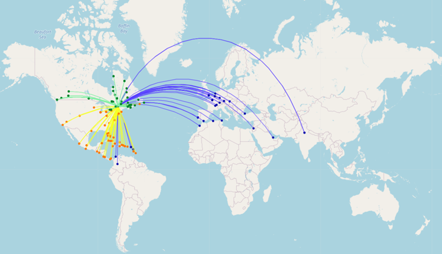

# LifRadarAvion
***
Bienvenue au sein de notre projet LifRadarAvion.

## Présentation
Le projet **LifRadarAvion** est réalisé dans le cadre de l'UE LIFPROJET de l'université 
Claude Bernard Lyon 1. Composé de deux étudiants, **DE JONG Anne** et **MERCIER Loris**, le
projet a pour but d'**analyser les données liées au trafic aérien mondiale**.

Avec plus de 36 millions de vols annuels à travers le monde, le transport aérien
est riche en données et nous permet de l'analyser sous 3 grands axes :
* **Une analyse géographique** (avec représentation sous forme de carte)
* **Une analyse statistiques** (avec représentation sous forme de graphique)
* **Des calculs d'itinéraires** (en utilisant les parcours de graphes) 





## Prérequis
Afin de pouvoir executer notre application (_Voir Site web pour une execution sans installation_), vous devez d'abord installer :
* Python 3.9 (python 3.10 n'est pas supporté)
* Une version de notebook jupyter

La liste des bibliothèques suivantes est ensuite nécessaire au bon fonctionnement de notre application :
* pandas (_Dataframe_)
* numpy (_Tableau_)
* csv (_Lecture fichier csv_)
* math (_Fonctions mathématiques_)
* folium (_Cartes interactives_)
* pyproj (_Calcul de coordonnées_)
* plotly (_Graphiques_)
* networkx (_Graphes_)
* ipywidget (_widget interactif_)
* IPython (_Notebook_)
* voila (_Site web_)
* ipyvuetify (_Framework site web_)
* markupsafe (_Texte HTML_)

```
pip install <PACKAGE>
```

Info : En cas de problèmes, retrouver notre configuration dans le fichier _requirements.txt_

## Comment executer le projet ?
- Ouvrer le fichier notebook_ANLO.ipynb
- Selectionner le kernel (python 3.9)
- Executer l'ensemble des cellules (Run all)

L'application est désormais opérationnelle

## Fonctionnement
Dans le fichier notebook_ANLO, utiliser les widgets disponibles afin d'afficher vos cartes/graphiques souhaités.  

En cas de widgets defectueux, décommenter la cellule précédent le widget puis lancer l'execution de cette dernière.  

Le fichier Creation_csv.ipynb est le script nous ayant permis de constituer nos fichiers csv présent dans _./data_. Il n'a pas vocation à être exécuté de nouveau.

## Site web interactif
Afin de retrouver nos résultats sans installation au préalable, consulter notre site web interactif en suivant le lien ci-dessous :  

[](https://mybinder.org/v2/gh/annevogel13/lifradar/HEAD?urlpath=voila%2Frender%2Fnotebook_ANLO.ipynb)

_Attention_ : Nos analyses graphiques ne sont disponibles que sur la partie notebook_

## Lancement du site en local
Saisisser la ligne de commande suivante pour lancer le site web en local
```
 voila --template vuetify-default  --enable_nbextensions=True --VoilaConfiguration.file_whitelist="['favicon.ico']" .\notebook_ANLO.ipynb
````
_/!\ Peut ne pas fonctionner en fonction des versions des biblitohèques installées. Consulter alors directement notre site en ligne._
